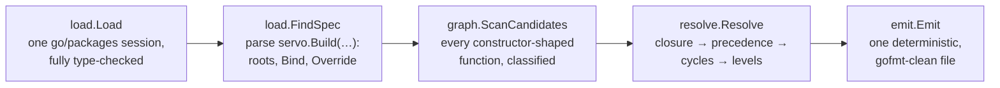
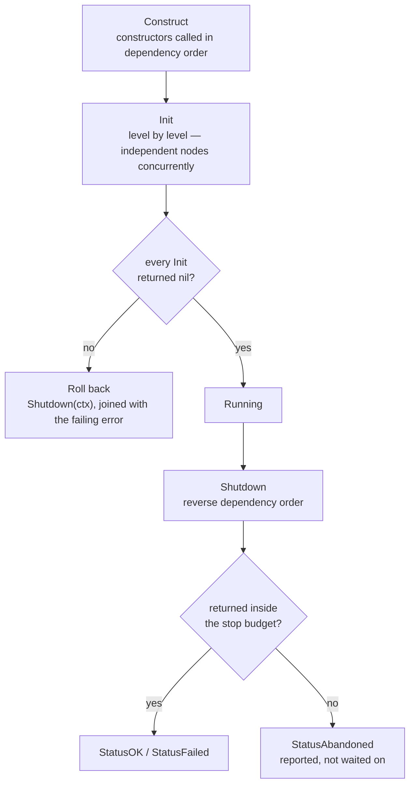

## One pipeline, seven views

Every command — `generate`, `check`, `graph`, `explain`, `why`, `list`, `doctor` — is a different
view onto the same stages, orchestrated by `cmd/servo/pipeline.go`.

`load.Load` runs once per module directory no matter how many injectors it contains. Everything
after it is per-injector: each `servo.Build(...)` in scope gets its own resolution pass, because a
monorepo's `cmd/api`, `cmd/worker`, and `cmd/migrator` roots don't share a graph even though they
share one type-checking session.

Resolution either produces a complete ordered plan or a set of diagnostics — never a partial
graph. [ARCHITECTURE.md](https://github.com/okian/servo/blob/master/ARCHITECTURE.md) covers how
each stage is built and why it's shaped that way.

## What the generated app does at runtime

The emitted `New`, `Run` and `Shutdown` are the whole lifecycle. Start-up runs in dependency
order and rolls back on failure; shutdown runs in reverse under a time budget, and reports any
node that refused to stop rather than hanging on it.

Nothing here is a framework callback: it is ordinary Go in a file you can read, step through, and
review in a pull request.
