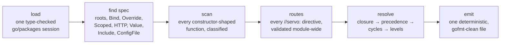
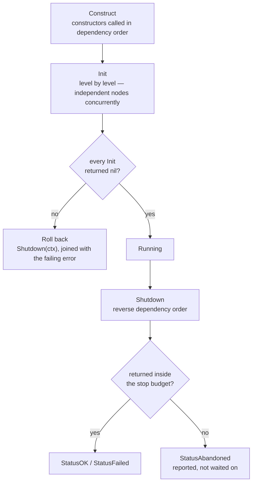

## One pipeline, eight views

`generate`, `check`, `graph`, `explain`, `why`, `list`, `config` and `doctor` are
not eight tools. They are eight windows onto the same six stages, which run in the
same order every time — though only `generate` and `check` reach the last one.

Loading happens once per module, however many injectors it contains, and so does
the route scan: a `//servo:get /healthz` comment declares an HTTP route wherever
it lives, and a spec declaring `servo.HTTP()` gets the servers for it emitted —
mux, typed request decoding, middleware, lifecycle. Everything else runs per
injector, because a monorepo's `cmd/api`, `cmd/worker` and `cmd/migrator` do not
share a graph even when they share a type-checking session.

Resolution has exactly two outcomes: a complete ordered plan, or a set of
diagnostics. Never a partial graph.

## What the generated app does when it runs

`New`, `Run` and `Shutdown` are the whole lifecycle. Start-up follows dependency
order and unwinds if any step fails; emitted HTTP servers are constructed last,
serve inside `Run`, and drain first. Shutdown runs the same list backwards under
a time budget, and reports anything that refused to stop rather than hanging on
it forever.

None of that is a framework callback. It is ordinary Go, in a file you can open,
step through in a debugger, and review in a pull request like any other code.
