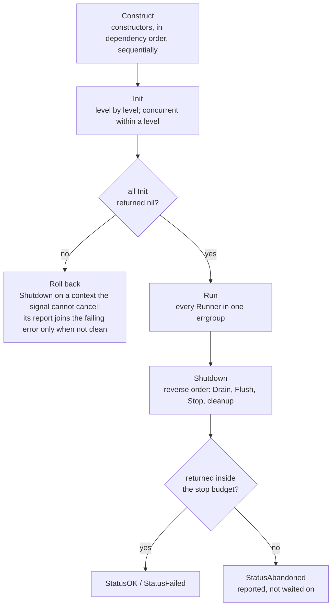

# Lifecycle

**Who this is for:** anyone implementing a component that needs to start, stop, or report its
health — and anyone debugging a startup failure or a shutdown that didn't come out clean.

The whole contract is seven method signatures. A component opts into the lifecycle by **having a
method**, not by registering for one: detection is structural, checked with `types.Implements` at
generation time, and no component ever imports `servo` to participate.

## The seven capabilities

```go
type Initializer interface{ Init(ctx context.Context) error }
type Runner      interface{ Run(ctx context.Context) error }
type Drainer     interface{ Drain(ctx context.Context) error }
type Flusher     interface{ Flush(ctx context.Context) error }
type Finalizer   interface{ Stop(ctx context.Context) error }
type Healther    interface{ Health(ctx context.Context) error }
type Readier     interface{ Ready(ctx context.Context) error }
```

| Capability | Method | Called during | Order | Under a budget |
| --- | --- | --- | --- | --- |
| `Initializer` | `Init` | `New` | Level by level, ascending; concurrent within a level | No |
| `Runner` | `Run` | `Run` | All at once, in one errgroup | No |
| `Drainer` | `Drain` | `Shutdown` | Reverse dependency order; first of the three | Yes |
| `Flusher` | `Flush` | `Shutdown` | After `Drain`, same node | Yes |
| `Finalizer` | `Stop` | `Shutdown` | After `Flush`, same node | Yes |
| `Healther` | `Health` | `Health`, when you call it | Construction order | No |
| `Readier` | `Ready` | `Ready`, when you call it | Construction order | No |

Implement none of them and your component is simply constructed and held — no lifecycle code is
emitted for it at all. Implement three and exactly those three are called. There is no base type to
embed, no no-op method to write, and nothing to register.

This page describes the lifecycle of a **singleton** — one instance, built in `New`, stopped in
`Shutdown`. A [scoped](scopes.md) component runs the same seven methods on the same machinery, but
per instance and on its own schedule; see
[Per-instance lifecycle](scopes.md#per-instance-lifecycle) for the two places the two differ.

`servo explain <type>` prints the capabilities detected for any node, and the generated file's
header comment lists them for the whole graph, so what servo saw is never a mystery.

## The phases



`New` covers Construct and Init. `Run` and `Shutdown` are separate calls your `main` makes. Nothing
here is a framework callback — it is all plain code in a file you can open and step through.

## Construct

Constructors are called sequentially, in dependency order. Every dependency is fully constructed
before anything that needs it, and each node is constructed exactly once no matter how many
consumers it has. Any [supplied value](spec.md#value) is copied out of `Values` first, ahead of
every constructor, since something has to be able to depend on it.

**If a constructor returns an error**, `New` stops there, undoes what it already built, and returns
that error. The rollback calls the stop path of every node constructed before the failure, in
reverse order — and only those, because the ones after it don't exist yet. That's why the rollback
is a literal, unrolled sequence of calls in the generated source rather than a runtime loop over a
"what succeeded so far" list: the compiler already knows.

Rollback results are discarded. The error you get back is the constructor's own, undiluted, because
the app was never fully assembled and a report about a half-built graph would be noise.

Construction is never concurrent, even for independent nodes. Calling a constructor is cheap —
almost always struct assignment — and a sequential `New` is one readable straight line, which is
worth more than microseconds.

## Init

`Init` is for the expensive part: opening a connection, running a migration, warming a cache.
Anything that can fail slowly belongs here rather than in a constructor, because this is the phase
built to handle failure.

Calls are grouped by [level](resolution.md#construction-order-and-levels). Levels run in ascending
order, so a component's dependencies are always initialised before it is. Within a level:

- **One node** → a direct call.
- **More than one** → an `errgroup.WithContext`, so they run concurrently and the first error
  cancels the context the others were given. The generated code special-cases the single-node case
  because an errgroup of one adds nothing but noise.

Each call is timed, and the durations are what `App.Report()` returns — per-node startup cost with
no external instrumentation. Within a concurrent level the report is in *completion* order, not a
declared order, so don't assert an exact sequence for nodes that share a level.

**If any `Init` fails**, `New` calls the app's own `Shutdown` — safe here, unlike during
construction, because every node exists by now — and returns:

```go
report := a.Shutdown(context.WithoutCancel(ctx))
if report.Clean() {
	return nil, err
}
return nil, errors.Join(err, report)
```

**A clean rollback returns the bare error.** `Report` satisfies `error` by value, so it is never nil
and `errors.Join` never skips it — and a clean report's `Error()` is the empty string, which
`errors.Join` still separates with a newline. Joining unconditionally appended a blank line to every
ordinary startup failure, and that trailing newline survives into any log field or `%w` wrapping
built from it. When the unwind *does* have something to say, the returned error carries both.

Either way `New` returns a nil `*App`: there is no partially initialised app to inspect.

## Stopping what was never initialised

**`Drain`, `Flush` and `Stop` can be called on a component whose `Init` never ran.** This is the
contract most easily missed, and the one that turns an ordinary startup failure into a panic during
the unwind.

Both rollback paths reach nodes that were only ever constructed:

- **A constructor failure** stops every node built *before* it. None of them has been `Init`ed at
  all — the `Init` phase has not started.
- **An `Init` failure** calls the app's own `Shutdown`, which walks the **whole** graph. That
  includes the node that just failed, and every node at a level *above* the failure, whose `Init`
  was never reached. `Shutdown` cannot be narrowed to "the ones that succeeded" without the runtime
  bookkeeping the generated code deliberately doesn't carry.

So a teardown method must tolerate the state its constructor left, not the state `Init` would have
produced:

```go
// Wrong. Reached during rollback with pool still nil, and the panic
// happens inside servo.RunStop's goroutine, mid-unwind.
func (d *DB) Stop(ctx context.Context) error { return d.pool.Close() }

// Right.
func (d *DB) Stop(ctx context.Context) error {
	if d.pool == nil {
		return nil
	}
	return d.pool.Close()
}
```

The general rule: whatever `Init` acquires, the matching teardown has to check for. A nil pool, a
nil client, a zero-value channel — a constructor that leaves them unset is ordinary Go, and the
rollback is exactly the path that exercises it. [`RunStop` recovers the
panic](#the-stop-budget) if you get this wrong, so the process survives and the node is reported as
failed, but the real startup error then arrives with a stack trace stapled to it.

**Both rollback paths run on `context.WithoutCancel(ctx)`.** They used to pass `New`'s own `ctx`
straight down, and every `main` in this documentation hands `New` the `signal.NotifyContext`
context. A SIGTERM arriving mid-startup — a rolling deploy, a pre-empted crash-loop restart —
therefore cancelled it, aborted an `Init`, and then the unwind was handed a context that was already
done. `servo.RunStop` derives its budget from it, so `Done` was closed before the `select` ran and
every node was reported abandoned without its `Drain`, `Flush` or `Stop` getting a chance to do
anything: the real startup error buried under a wall of `abandoned: context canceled`.

Stripping the cancellation is the same rule this page states for a hand-written `main`'s
[`Shutdown`](#run), and the one [scoped teardown](scopes.md) already followed. Nothing can hang as a
result — `RunStop` still caps every phase at its own budget.

## Run

```go
func (a *App) Run(ctx context.Context) error
```

Launches every `Runner`. The shape depends on how many there are:

- **None** → returns `nil` immediately.
- **One** → calls it directly and returns its error.
- **Several** → an `errgroup.WithContext`. Each runner gets the group's context, so one runner
  returning an error cancels every other runner, and `Run` doesn't return until all of them have
  returned.

`Run` blocks for as long as the application is running. It does **not** call `Shutdown` — that's
your `main`'s job, so that the same code path handles both "a runner failed" and "we got a signal".
The canonical `main` is:

```go
// servo.RunStop caps each node at servo.DefaultStopBudget, but nothing caps
// their sum, so the whole teardown gets a deadline of its own.
const shutdownTimeout = 30 * time.Second

func main() {
	ctx, stop := signal.NotifyContext(context.Background(), os.Interrupt, syscall.SIGTERM)
	defer stop()

	app, err := New(ctx)
	if err != nil {
		log.Fatal(err)
	}
	if err := app.Run(ctx); err != nil {
		log.Print(err)
	}
	// Not ctx: it is already cancelled, and that cancellation is what started
	// the shutdown. Not a bare context.Background() either, so the unwind
	// cannot outlast the grace period it is running inside.
	sctx, cancel := context.WithTimeout(context.Background(), shutdownTimeout)
	defer cancel()
	if r := app.Shutdown(sctx); !r.Clean() {
		log.Print(r)
	}
}
```

Note `Shutdown` gets a *fresh* context. The one passed to `Run` is already cancelled by the time a
signal has arrived, and handing a cancelled context to shutdown would abandon every node
instantly.

## Shutdown

```go
func (a *App) Shutdown(ctx context.Context) servo.Report
```

Stops every node with something to stop, in **reverse dependency order** — so a server stops
before the database it queries. For each node, in this order:

1. `Drain(ctx)` — stop accepting new work and let in-flight work finish
2. `Flush(ctx)` — push buffered state somewhere durable
3. `Stop(ctx)` — release the resource
4. the constructor's cleanup `func()`, if it returned a non-nil one

Only the phases that node actually implements are emitted. **Each phase gets its own budget**, so a
node implementing all three can take up to three budgets in the worst case.

There is deliberately no separate "quiesce" phase. Waiting for in-flight work is `Drain`'s job,
inside your own component, where the knowledge of what counts as in-flight actually lives.

**Every node's stop path is idempotent**, guarded by a `sync.Once`, because the same path is
reachable from both construction rollback and `Shutdown`. Calling `Shutdown` twice returns the same
results without touching your components again. It is also why these methods have to tolerate a
node that was never `Init`ed: see [Stopping what was never
initialised](#stopping-what-was-never-initialised).

`Shutdown` never returns an error — it returns a [`servo.Report`](servo-package.md#report), which
is a per-node account of what happened. It also satisfies `error`, so it composes with
`errors.Join` and `%w`. Check `r.Clean()` for the one-line answer.

**A second signal during shutdown forces an immediate exit.** `Shutdown` installs its own
`os.Interrupt`/`SIGTERM` handler for the duration of the call and calls `os.Exit(1)` if one
arrives. The *first* signal is handled by `signal.NotifyContext` in your `main`; this is only the
second-signal half, and it lives in generated code so your `main` needs no extra logic for it.

## The stop budget

```go
var servo.DefaultStopBudget = 5 * time.Second
```

Every phase call during shutdown and rollback runs under this budget, through
[`servo.RunStop`](servo-package.md#runstop): the call is made in its own goroutine, and if it hasn't
returned when the budget expires the node is reported **abandoned** rather than waited on.

The same budget bounds every per-instance call inside a scope's teardown, so one component that
refuses to stop cannot hold a whole scope's eviction open.

| Outcome | Status | Meaning |
| --- | --- | --- |
| Returned `nil` in time | `StatusOK` | Stopped cleanly |
| Returned an error in time | `StatusFailed` | Tried to stop and failed; the error is on the result |
| Panicked | `StatusFailed` | The panic is recovered; the value and the stack become the error |
| Didn't return in time | `StatusAbandoned` | The context deadline is the error; the goroutine is left running |

Abandoned means exactly what it says: the process moves on and the goroutine may still be alive.
Servo takes the position that reporting an abandoned node honestly beats hanging forever, and it
never claims a clean stop it didn't earn.

**A panic in a stop phase is recovered and reported, not propagated.** The phase call runs in
servo's goroutine, not yours, so no `recover` in your `main` could ever reach it: unrecovered, one
panicking `Stop` kills the process mid-teardown, leaving every node behind it running and no
`Report` to say which. `servo.RunStop` turns it into one `StatusFailed` node carrying the panic
value and the stack, and the rest of the unwind continues. This is what keeps a `Stop` that assumes
`Init` ran — see [Stopping what was never initialised](#stopping-what-was-never-initialised) — from
taking the process down during a rollback.

Per-node results are merged with **abandoned outranking failed outranking OK**, and every phase's
error joined, so one node with a clean `Drain` and a timed-out `Stop` is reported once, as
abandoned.

It is a package variable rather than configuration because parsing configuration is out of scope
for a code generator. Set it before `New` if 5 seconds is wrong for your service; in tests, use
[`servotest.Timeout`](servotest-package.md#timeout), which shrinks it and restores it via
`t.Cleanup`.

### Scopes in the shutdown sequence

An app with [scopes](scopes.md) gets one extra step per scope, sequenced into the same
reverse-dependency order: after every singleton that could still call `Acquire` on it, and before
every singleton its instances depend on. Each scope reports **one `NodeResult`**, merged from every
entry it tore down — one line per live chat room would not be a report.

## Health and Ready

```go
func (a *App) Health(ctx context.Context) servo.Report
func (a *App) Ready(ctx context.Context) servo.Report
```

Both are flat, per-node, and **not called automatically by anything**. Servo emits them; you decide
when they run — typically from an HTTP handler:

```go
http.HandleFunc("/healthz", func(w http.ResponseWriter, r *http.Request) {
	if rep := app.Health(r.Context()); !rep.Clean() {
		http.Error(w, rep.Error(), http.StatusServiceUnavailable)
		return
	}
	w.WriteHeader(http.StatusOK)
})
```

Each node implementing the capability is called once, in construction order, and every result lands
in the report — there's no early return on the first failure, and no transitive aggregation. A node
whose dependency is unhealthy is not itself marked unhealthy; it reports on itself. Statuses here
are only `StatusOK` or `StatusFailed`: no budget is applied, so a `Health` method that blocks
blocks the whole call. Respect the context you're given.

The distinction between the two is yours to define, and the conventional one is worth keeping:
`Health` means "this process is not broken" (restart me if it fails), `Ready` means "send me
traffic" (take me out of the load balancer if it fails).

## The cleanup func

A constructor may return a cleanup function alongside its value:

```go
func New(cfg Config) (*Client, func(), error)
```

It is called **last** in that node's stop sequence, after `Drain`/`Flush`/`Stop`, under its own
budget like any other phase, and it takes no context and returns no error.

**A nil cleanup func is skipped, not called.** Returning `nil` from a path that has nothing to undo
is ordinary Go, and `(T, func(), error)` is a documented provider shape, so the generated stop
method guards the call — `if a.dbCleanup != nil { … }`. Unguarded, that nil call panicked inside
`servo.RunStop`'s own goroutine. Skipping the phase rather than recording an `OK` result for it
leaves the merged `NodeResult` identical either way, so nothing downstream can tell the difference.

### Why this exists when `Finalizer` does

The obvious question, since `Stop(ctx) error` looks strictly better — it takes a context, so it can
respect a deadline, and returns an error, so a failure lands in the
[`Report`](servo-package.md#report) instead of vanishing. A cleanup func can do neither.

It exists for teardown that is not about the value at all. A method only has the receiver; a
closure captures whatever the constructor had. If setup created something the returned value never
holds a reference to — a temp directory known only by its path, a global default that was swapped,
a registration keyed by a local variable — the closure can undo it and a method cannot, short of
widening the struct with a field that exists only to be torn down:

```go
func NewStore() (*Store, func(), error) {
	dir, err := os.MkdirTemp("", "store")
	if err != nil {
		return nil, nil, err
	}
	s, err := open(dir)
	if err != nil {
		os.RemoveAll(dir)
		return nil, nil, err
	}
	// *Store never learns about dir, and does not need to.
	return s, func() { os.RemoveAll(dir) }, nil
}
```

One thing not to expect from it: it does not let you return a type from another module to avoid
writing a method. `func New() (*os.File, func(), error)` resolves only if exactly one function in
scope produces `*os.File`, and seven in the standard library do — so `servo generate` reports the
ambiguity rather than picking one. In practice a foreign value gets wrapped in a type you own,
which is where `Stop` becomes available again, and better.

## What this looks like generated

For [`examples/basic`](https://github.com/okian/servo/tree/master/examples/basic) — a logger, a
Postgres DB, an API server, a worker, and a relay with two queue accounts — the emitted shutdown is
just this:

```go
func (a *App) Shutdown(ctx context.Context) servo.Report {
	// ... second-signal watcher ...
	var nodes []servo.NodeResult
	nodes = append(nodes, a.stopServer(ctx))
	nodes = append(nodes, a.stopDb(ctx))
	nodes = append(nodes, a.stopLogger(ctx))
	return servo.Report{Nodes: nodes}
}

func (a *App) stopServer(ctx context.Context) servo.NodeResult {
	a.serverStopOnce.Do(func() {
		var results []servo.NodeResult
		results = append(results, servo.RunStop(ctx, servo.DefaultStopBudget, "*api.Server", a.server.Drain))
		results = append(results, servo.RunStop(ctx, servo.DefaultStopBudget, "*api.Server", a.server.Stop))
		a.serverStopResult = servo.MergeNodeResults("*api.Server", results...)
	})
	return a.serverStopResult
}
```

The worker and the queue accounts appear nowhere in it: the worker implements only `Runner`, and the
queue accounts implement nothing, so there is nothing to stop. Reverse order, per-phase budgets and
idempotency are all visible in the source rather than hidden in a framework — which is the whole
point.
