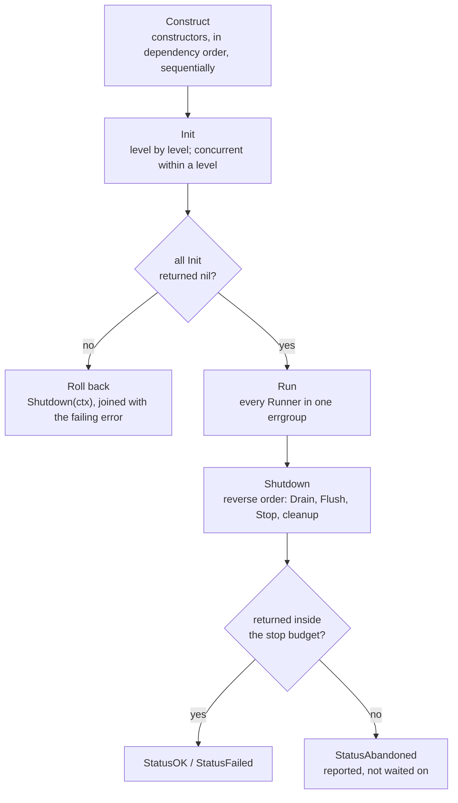

# Lifecycle

**Who this is for:** anyone implementing a component that needs to start, stop, or report its
health — and anyone debugging a startup failure or a shutdown that didn't come out clean.

The whole contract is seven method signatures. A component opts into the lifecycle by **having a
method**, not by registering for one: detection is structural, checked with `types.Implements` at
generation time, and no component ever imports `servo` to participate.

## The seven capabilities

```go
type Initializer interface{ Init(ctx context.Context) error }
type Runner      interface{ Run(ctx context.Context) error }
type Drainer     interface{ Drain(ctx context.Context) error }
type Flusher     interface{ Flush(ctx context.Context) error }
type Finalizer   interface{ Stop(ctx context.Context) error }
type Healther    interface{ Health(ctx context.Context) error }
type Readier     interface{ Ready(ctx context.Context) error }
```

| Capability | Method | Called during | Order | Under a budget |
| --- | --- | --- | --- | --- |
| `Initializer` | `Init` | `New` | Level by level, ascending; concurrent within a level | No |
| `Runner` | `Run` | `Run` | All at once, in one errgroup | No |
| `Drainer` | `Drain` | `Shutdown` | Reverse dependency order; first of the three | Yes |
| `Flusher` | `Flush` | `Shutdown` | After `Drain`, same node | Yes |
| `Finalizer` | `Stop` | `Shutdown` | After `Flush`, same node | Yes |
| `Healther` | `Health` | `Health`, when you call it | Construction order | No |
| `Readier` | `Ready` | `Ready`, when you call it | Construction order | No |

Implement none of them and your component is simply constructed and held — no lifecycle code is
emitted for it at all. Implement three and exactly those three are called. There is no base type to
embed, no no-op method to write, and nothing to register.

`servo explain <type>` prints the capabilities detected for any node, and the generated file's
header comment lists them for the whole graph, so what servo saw is never a mystery.

## The phases



`New` covers Construct and Init. `Run` and `Shutdown` are separate calls your `main` makes. Nothing
here is a framework callback — it is all plain code in a file you can open and step through.

## Construct

Constructors are called sequentially, in dependency order. Every dependency is fully constructed
before anything that needs it, and each node is constructed exactly once no matter how many
consumers it has.

**If a constructor returns an error**, `New` stops there, undoes what it already built, and returns
that error. The rollback calls the stop path of every node constructed before the failure, in
reverse order — and only those, because the ones after it don't exist yet. That's why the rollback
is a literal, unrolled sequence of calls in the generated source rather than a runtime loop over a
"what succeeded so far" list: the compiler already knows.

Rollback results are discarded. The error you get back is the constructor's own, undiluted, because
the app was never fully assembled and a report about a half-built graph would be noise.

Construction is never concurrent, even for independent nodes. Calling a constructor is cheap —
almost always struct assignment — and a sequential `New` is one readable straight line, which is
worth more than microseconds.

## Init

`Init` is for the expensive part: opening a connection, running a migration, warming a cache.
Anything that can fail slowly belongs here rather than in a constructor, because this is the phase
built to handle failure.

Calls are grouped by [level](resolution.md#construction-order-and-levels). Levels run in ascending
order, so a component's dependencies are always initialised before it is. Within a level:

- **One node** → a direct call.
- **More than one** → an `errgroup.WithContext`, so they run concurrently and the first error
  cancels the context the others were given. The generated code special-cases the single-node case
  because an errgroup of one adds nothing but noise.

Each call is timed, and the durations are what `App.Report()` returns — per-node startup cost with
no external instrumentation. Within a concurrent level the report is in *completion* order, not a
declared order, so don't assert an exact sequence for nodes that share a level.

**If any `Init` fails**, `New` calls the app's own `Shutdown` — safe here, unlike during
construction, because every node exists by now — and returns:

```go
return nil, errors.Join(err, report)
```

So the returned error carries both the failure and everything that happened while unwinding. `New`
returns a nil `*App`: there is no partially initialised app to inspect.

## Run

```go
func (a *App) Run(ctx context.Context) error
```

Launches every `Runner`. The shape depends on how many there are:

- **None** → returns `nil` immediately.
- **One** → calls it directly and returns its error.
- **Several** → an `errgroup.WithContext`. Each runner gets the group's context, so one runner
  returning an error cancels every other runner, and `Run` doesn't return until all of them have
  returned.

`Run` blocks for as long as the application is running. It does **not** call `Shutdown` — that's
your `main`'s job, so that the same code path handles both "a runner failed" and "we got a signal".
The canonical `main` is:

```go
func main() {
	ctx, stop := signal.NotifyContext(context.Background(), os.Interrupt, syscall.SIGTERM)
	defer stop()

	app, err := New(ctx)
	if err != nil {
		log.Fatal(err)
	}
	if err := app.Run(ctx); err != nil {
		log.Print(err)
	}
	if r := app.Shutdown(context.Background()); !r.Clean() {
		log.Print(r)
	}
}
```

Note `Shutdown` gets a *fresh* context. The one passed to `Run` is already cancelled by the time a
signal has arrived, and handing a cancelled context to shutdown would abandon every node
instantly.

## Shutdown

```go
func (a *App) Shutdown(ctx context.Context) servo.Report
```

Stops every node with something to stop, in **reverse dependency order** — so a server stops
before the database it queries. For each node, in this order:

1. `Drain(ctx)` — stop accepting new work and let in-flight work finish
2. `Flush(ctx)` — push buffered state somewhere durable
3. `Stop(ctx)` — release the resource
4. the constructor's cleanup `func()`, if it returned one

Only the phases that node actually implements are emitted. **Each phase gets its own budget**, so a
node implementing all three can take up to three budgets in the worst case.

There is deliberately no separate "quiesce" phase. Waiting for in-flight work is `Drain`'s job,
inside your own component, where the knowledge of what counts as in-flight actually lives.

**Every node's stop path is idempotent**, guarded by a `sync.Once`, because the same path is
reachable from both construction rollback and `Shutdown`. Calling `Shutdown` twice returns the same
results without touching your components again.

`Shutdown` never returns an error — it returns a [`servo.Report`](servo-package.md#report), which
is a per-node account of what happened. It also satisfies `error`, so it composes with
`errors.Join` and `%w`. Check `r.Clean()` for the one-line answer.

**A second signal during shutdown forces an immediate exit.** `Shutdown` installs its own
`os.Interrupt`/`SIGTERM` handler for the duration of the call and calls `os.Exit(1)` if one
arrives. The *first* signal is handled by `signal.NotifyContext` in your `main`; this is only the
second-signal half, and it lives in generated code so your `main` needs no extra logic for it.

## The stop budget

```go
var servo.DefaultStopBudget = 5 * time.Second
```

Every phase call during shutdown and rollback runs under this budget, through
[`servo.RunStop`](servo-package.md#runstop): the call is made in its own goroutine, and if it hasn't
returned when the budget expires the node is reported **abandoned** rather than waited on.

| Outcome | Status | Meaning |
| --- | --- | --- |
| Returned `nil` in time | `StatusOK` | Stopped cleanly |
| Returned an error in time | `StatusFailed` | Tried to stop and failed; the error is on the result |
| Didn't return in time | `StatusAbandoned` | The context deadline is the error; the goroutine is left running |

Abandoned means exactly what it says: the process moves on and the goroutine may still be alive.
Servo takes the position that reporting an abandoned node honestly beats hanging forever, and it
never claims a clean stop it didn't earn.

Per-node results are merged with **abandoned outranking failed outranking OK**, and every phase's
error joined, so one node with a clean `Drain` and a timed-out `Stop` is reported once, as
abandoned.

It is a package variable rather than configuration because parsing configuration is out of scope
for a code generator. Set it before `New` if 5 seconds is wrong for your service; in tests, use
[`servotest.Timeout`](servotest-package.md#timeout), which shrinks it and restores it via
`t.Cleanup`.

## Health and Ready

```go
func (a *App) Health(ctx context.Context) servo.Report
func (a *App) Ready(ctx context.Context) servo.Report
```

Both are flat, per-node, and **not called automatically by anything**. Servo emits them; you decide
when they run — typically from an HTTP handler:

```go
http.HandleFunc("/healthz", func(w http.ResponseWriter, r *http.Request) {
	if rep := app.Health(r.Context()); !rep.Clean() {
		http.Error(w, rep.Error(), http.StatusServiceUnavailable)
		return
	}
	w.WriteHeader(http.StatusOK)
})
```

Each node implementing the capability is called once, in construction order, and every result lands
in the report — there's no early return on the first failure, and no transitive aggregation. A node
whose dependency is unhealthy is not itself marked unhealthy; it reports on itself. Statuses here
are only `StatusOK` or `StatusFailed`: no budget is applied, so a `Health` method that blocks
blocks the whole call. Respect the context you're given.

The distinction between the two is yours to define, and the conventional one is worth keeping:
`Health` means "this process is not broken" (restart me if it fails), `Ready` means "send me
traffic" (take me out of the load balancer if it fails).

## The cleanup func

A constructor may return a cleanup function alongside its value:

```go
func New(cfg Config) (*Client, func(), error)
```

It's for teardown that isn't naturally a method — closing something the constructor opened, undoing
a global registration, removing a temp directory. It is called **last** in that node's stop
sequence, after `Drain`/`Flush`/`Stop`, under its own budget like any other phase, and it takes no
context and returns no error.

If your teardown wants a context or has a meaningful error, write a `Stop(ctx) error` method
instead.

One trap worth naming: never route a mock's verification call (gomock's `ctrl.Finish`) through the
cleanup func. It runs inside `RunStop`'s goroutine during shutdown, and an unmet expectation panics
there — in a goroutine nothing can recover, crashing the test binary with no indication of which
test was running. Call it directly from the test with a plain `defer`; the README's
[Mocking section](https://github.com/okian/servo/blob/master/README.md#gouberorgmock-gomock) has
the full explanation.

## What this looks like generated

For [`examples/basic`](https://github.com/okian/servo/tree/master/examples/basic) — a logger, a
Postgres DB, an API server, a worker, and a relay with two queue accounts — the emitted shutdown is
just this:

```go
func (a *App) Shutdown(ctx context.Context) servo.Report {
	// ... second-signal watcher ...
	var nodes []servo.NodeResult
	nodes = append(nodes, a.stopServer(ctx))
	nodes = append(nodes, a.stopDb(ctx))
	nodes = append(nodes, a.stopLogger(ctx))
	return servo.Report{Nodes: nodes}
}

func (a *App) stopServer(ctx context.Context) servo.NodeResult {
	a.serverStopOnce.Do(func() {
		var results []servo.NodeResult
		results = append(results, servo.RunStop(ctx, servo.DefaultStopBudget, "*api.Server", a.server.Drain))
		results = append(results, servo.RunStop(ctx, servo.DefaultStopBudget, "*api.Server", a.server.Stop))
		a.serverStopResult = servo.MergeNodeResults("*api.Server", results...)
	})
	return a.serverStopResult
}
```

The worker and the queue accounts appear nowhere in it: the worker implements only `Runner`, and the
queue accounts implement nothing, so there is nothing to stop. Reverse order, per-phase budgets and
idempotency are all visible in the source rather than hidden in a framework — which is the whole
point.
