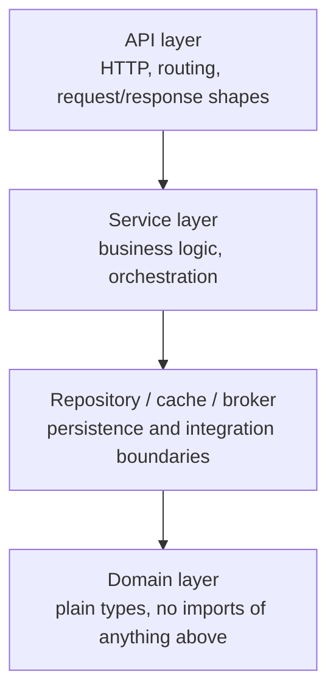

# 1. Architecture overview

Before any code, it's worth spending one chapter on the shape we're building toward and why —
otherwise the first few chapters are just packages appearing with no sense of how they'll fit
together. This chapter has no exercises; read it, then chapter 2 starts actually building.

## Why layers

A layered architecture separates code by *what it depends on*, not by what feature it belongs to.
Four layers, each only allowed to depend on the ones below it:

The rule that makes this worth doing is directional: **domain code never imports anything above
it**, and each layer only talks to the one directly below through an interface it defines, not the
concrete thing that satisfies it. A few concrete payoffs, not abstract ones:

- The service layer's business logic can be unit-tested against a fake repository, with no
  database, no network call, and no test flakiness from either — see
  [chapter 14](14-testing-strategy.md).
- Swapping Postgres for something else touches the `postgres` package and nothing that imports
  `repository`'s interfaces, because nothing else was ever allowed to import `postgres` directly.
- A bug report that says "orders sometimes have the wrong quantity" has exactly one layer where
  quantity validation could live, because the domain layer is the only place validation rules are
  allowed to be duplicated by design — see [chapter 4](04-domain-layer.md).

## Where servo fits

Every layer above still needs to be *constructed* and *started in the right order* — the API
layer's HTTP server can't accept traffic before the database connection it depends on is ready,
and shutdown has to happen in the reverse order for the same reason. Hand-writing that (a `main.go`
that constructs a logger, then a database, then a cache, then a service, then a server, checking
errors and rolling back partial construction at every step, then reversing the whole thing on
shutdown) is exactly the kind of code that's tedious to write, easy to get subtly wrong, and grows
linearly with every component you add.

`servo` generates that code instead of asking you to write it: you write ordinary constructor
functions, tell it which types are your graph's roots, and it resolves the dependency order,
detects capabilities (does this type need to connect to something on startup? disconnect on
shutdown? report its own health?) structurally, and emits one plain Go file that does the
construction, startup, and shutdown — checked by the compiler, steppable in a debugger, reviewable
in a pull request like any other generated code. [Chapter 11](11-wiring-with-servo.md) is where
this actually happens, once there's a real graph worth wiring.

## The service you're about to build

An order service: authenticated users place orders and look them up. It's deliberately small — no
user signup, no payment processing, no order-status transitions beyond "pending" — because the
point is the architecture and the wiring, not the business domain. Every layer is still real,
though: real Postgres, real Redis, real NATS, a real JWT, not simplified stand-ins.

| Endpoint | Auth | Does |
|---|---|---|
| `POST /auth/login` | none | Exchange a username/password for a JWT |
| `POST /orders` | Bearer JWT | Create an order for the authenticated user |
| `GET /orders/{id}` | Bearer JWT | Fetch one order (cached; 403 if it isn't yours) |
| `GET /orders` | Bearer JWT | List the authenticated user's orders, paginated |
| `GET /healthz` / `GET /readyz` | none | Liveness / readiness, from servo's capability system |
| `GET /metrics` | none | Prometheus scrape endpoint |

## Technology choices

| Concern | Choice | Why (briefly — see [chapter 18](18-alternatives-and-further-reading.md) for alternatives) |
|---|---|---|
| Dependency injection | servo | The subject of this tutorial |
| HTTP | `net/http` (stdlib) | Go 1.22+'s router is enough for five routes; no framework opinion to explain |
| Database | Postgres via `pgx` | The most common real choice for relational data in Go services |
| Cache | Redis via `go-redis` | Ubiquitous, simple cache-aside semantics |
| Messaging | NATS | Self-hosted via Docker, no cloud account needed, easy to explain |
| Auth | JWT (HS256) via `golang-jwt` | Stateless, standard, easy to verify without a shared session store |
| Config | Typed struct via `caarlos0/env` | Fails fast on missing config, no stringly-typed `os.Getenv` scattered around |
| Logging | `log/slog` (stdlib) | Structured logging with no extra dependency |
| Metrics | Prometheus via `client_golang` | The de facto standard for pull-based metrics |
| Tracing | OpenTelemetry | Vendor-neutral; exports to Jaeger locally |
| Resilience | `sony/gobreaker`, `golang.org/x/time/rate` | Circuit breaker and rate limiting |
| Testing | `testify`, `go.uber.org/mock` | Assertions and mocks, same tools servo's own examples use |

## Do's and don'ts

- **Do** let each layer define the interface it needs, owned by the *consumer*, not the
  implementer — `repository.OrderRepository` lives in `repository/`, not `postgres/`. This is what
  makes mocking possible without an interface-extraction refactor later.
- **Don't** let domain types grow HTTP or database concerns (a `json` struct tag is fine; a method
  that returns an `http.StatusCode` is not). The moment `domain` needs to import `net/http`, the
  layering has already broken down.
- **Don't** treat "four layers" as a rule to apply everywhere without judgment. A five-endpoint
  internal tool doesn't need this; the point of this tutorial is showing the pattern at a scale
  where you can see the whole thing, not arguing every service needs it.

## Diagnostics: is this the right architecture for your problem?

If you're deciding whether to reach for this shape at all:

- **A single binary with no network boundary** (a CLI tool, a batch job) rarely benefits from
  repository/service/API separation — there's no API layer to justify it.
- **A service that's mostly a thin proxy** to another API doesn't need a repository layer at all;
  forcing one in adds a file with no logic in it.
- **A service under real, sustained load** benefits from this shape specifically *because* it makes
  the resilience and observability chapters ([12](12-observability.md), [13](13-resilience.md))
  possible to reason about — they hook in at layer boundaries.

## Next

[Chapter 2: Project setup](02-project-setup.md) — initializing the module and installing the
tools you'll be using throughout.
