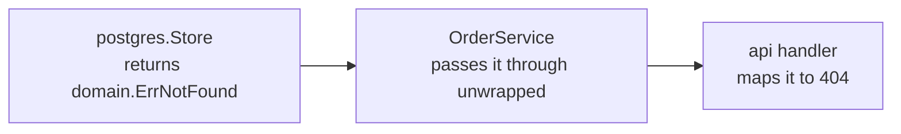

# 4. Domain layer

Before writing anything that talks to a database or an HTTP request, we need to decide what an
"order" and a "user" actually *are* in this system — independent of how they'll be stored, cached,
or served. That's the whole job of this chapter, and it's deliberately the smallest one: a package
with no dependency on anything else we'll write, so every later chapter has something stable to
build against instead of chasing a moving target.

## Create the domain package

Create `domain/domain.go`. Start with what an order status can be:

```go
package domain

import (
	"errors"
	"time"

	"github.com/google/uuid"
)

type OrderStatus string

const OrderStatusPending OrderStatus = "pending"
```

Just one status for now — this service never transitions an order out of `pending`. If it needed
to later (`shipped`, `cancelled`), this is where that would live, along with whatever rules govern
which transitions are legal; a `const` type is enough for a closed set of values on its own.

Now the two types everything else in this tutorial will pass around:

```go
type Order struct {
	ID        uuid.UUID
	UserID    uuid.UUID
	Item      string
	Quantity  int
	Status    OrderStatus
	CreatedAt time.Time
}

type User struct {
	ID           uuid.UUID
	Username     string
	PasswordHash string
}
```

Notice `ID` and `UserID` are `uuid.UUID`, generated in our own code (`uuid.New()`), not integers a
database assigns. Two reasons this matters, not just a style choice: an ID never has to round-trip
through Postgres before the rest of the code can use it — the service layer will generate an
order's ID, publish it in an event, and write it to the database, in whatever order is convenient,
because nothing is waiting on the database to hand back an auto-incremented value first (see
[chapter 7](07-messaging-layer.md)). And an ID is never guessable or enumerable, which matters the
moment one shows up in a URL (`GET /orders/{id}`) that only its owner should be able to fetch.

## Add the errors every other layer will check for

```go
var (
	ErrNotFound   = errors.New("resource not found")
	ErrForbidden  = errors.New("access forbidden")
	ErrValidation = errors.New("validation failed")
)
```

These three sentinel errors are what the rest of the service will use to talk about failure,
instead of each layer inventing its own. The repository we build in the next chapter will return
`ErrNotFound` when a row doesn't exist; the service layer will return `ErrForbidden` when someone
requests an order that isn't theirs; and only the API layer, right at the edge, will translate each
one into an HTTP status code:



The reason these live in `domain` and not, say, `postgres` (where the not-found case first comes
up) is what makes that translation trustworthy: if the *repository* had defined `ErrNotFound`,
the service layer would need a compile-time dependency on `postgres` just to check an error — the
exact layering violation [chapter 1](01-architecture-overview.md#why-layers) set out to avoid.
Defining them here means every layer above can depend on the error without depending on whichever
package first produced it.

## What doesn't belong here

It's worth naming the boundary explicitly, since it's easy to blur once real code starts landing
in this file. A `json:"..."` struct tag is fine — it doesn't imply a specific transport. A method
that returns an `http.StatusCode`, or a field typed as something from `database/sql`, is not: the
moment `domain` needs to import `net/http` or a driver package, the layering has quietly stopped
meaning anything. If validation rules grow later (a maximum quantity, an allowed set of items), a
`Validate() error` method on `Order` would belong here too, so the rule is enforced no matter which
layer constructs one. This tutorial's validation is simple enough that it lives inline in
[the service layer](08-service-layer.md) instead — a reflection of how little there is to validate
yet, not a rule to copy.

## Nothing to test yet

There's no test file for this chapter, and that's deliberate rather than an oversight: everything
in `domain.go` right now is a type or constant declaration with no branching logic, and a test
would just restate the code back to itself. That changes the moment real logic — like the
`Validate()` method above — actually lands here.

## Diagnostics

- **Tempted to import `context` here?** That's fine on its own — domain types don't do I/O, but
  nothing stops the package from holding pure, cancellable functions later. What's not fine is
  importing anything that implies a specific transport or storage technology.

## Do's and don'ts

- **Don't** put `OrderStatus` transition logic directly on the type without a plan — validating
  *which* transitions are legal is business logic, and belongs in [`service`](08-service-layer.md),
  not scattered across whichever layer happens to set the field.
- **Don't** add a struct tag here that only one consumer cares about — a `db:"..."` tag tied to a
  specific SQL library's scanning convention belongs in `postgres`, not here.

## Next

[Chapter 5: Repository layer](05-repository-layer.md) — persisting `domain.Order` and
`domain.User` for real, in Postgres.
