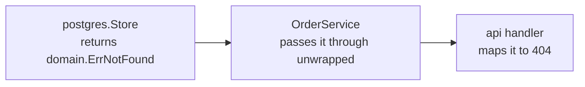

# 4. Domain layer

## What belongs here

The domain layer is the smallest, most boring package in the service, and that's the point: it's
plain types and sentinel errors, with no import of `net/http`, `pgx`, `redis`, or `servo` itself.
Everything else in this tutorial depends on `domain`; `domain` depends on nothing but the standard
library and `github.com/google/uuid`.

```go
// examples/tutorial/domain/domain.go
type OrderStatus string

const OrderStatusPending OrderStatus = "pending"

type Order struct {
	ID        uuid.UUID
	UserID    uuid.UUID
	Item      string
	Quantity  int
	Status    OrderStatus
	CreatedAt time.Time
}

type User struct {
	ID           uuid.UUID
	Username     string
	PasswordHash string
}

var (
	ErrNotFound   = errors.New("resource not found")
	ErrForbidden  = errors.New("access forbidden")
	ErrValidation = errors.New("validation failed")
)
```

## Why sentinel errors, and why here

`ErrNotFound`, `ErrForbidden`, and `ErrValidation` are checked with `errors.Is` by every layer
above `domain` — the repository returns `domain.ErrNotFound` when a row doesn't exist
([chapter 5](05-repository-layer.md)), the service layer returns `domain.ErrForbidden` when a user
requests someone else's order ([chapter 8](08-service-layer.md)), and the API layer is the *one*
place that maps each of them to an HTTP status code ([chapter 10](10-api-layer.md)):



Defining these in `domain` rather than in `postgres` or `api` is what keeps that mapping honest:
if the *repository* defined `ErrNotFound`, the service layer would have a compile-time dependency
on `postgres` just to check an error — exactly the layering violation
[chapter 1](01-architecture-overview.md#why-layers) is about avoiding.

## Why UUIDs instead of auto-incrementing integers

`Order.ID` and `User.ID` are `uuid.UUID`, generated in application code
(`uuid.New()`), not database-assigned `SERIAL` integers. Two real reasons, not just a style
preference: an ID never has to round-trip through the database before the rest of the code (the
service layer can generate an order's ID, publish it in an event, and write it to Postgres in any
order — see [chapter 7](07-messaging-layer.md)); and IDs are never guessable or sequentially
enumerable, which matters the moment an ID appears in a URL (`GET /orders/{id}`) that only an
owner should be able to fetch.

## Diagnostics

- **A function in a "domain" package needs to import `context`** — that's fine. Domain types
  themselves don't do I/O, but nothing says the package can't hold pure functions that take a
  `context.Context` if you later add domain-level operations that should be cancellable. What's not
  fine is importing `database/sql`, `net/http`, or anything that implies a specific transport or
  storage technology.
- **Tempted to add a `Validate() error` method to `Order`?** That's a reasonable evolution once
  validation rules exist (a maximum quantity, an allowed set of items) — put it here, not in the
  API layer's request-decoding code, so the rule is enforced no matter which layer constructs an
  `Order`. This tutorial's validation is simple enough to live inline in
  [the service layer](08-service-layer.md) instead; don't take that as a rule, just as this
  example's actual complexity budget.

## Do's and don'ts

- **Do** keep this package free of struct tags that only matter to one consumer — a `json:"..."`
  tag is fine since it's genuinely shape-neutral, but a `db:"..."` tag tied to a specific SQL
  library's scanning convention belongs in `postgres`, not here.
- **Don't** put `OrderStatus` state-transition logic in this file if it grows (e.g. "pending can
  become shipped or cancelled, but not the reverse"). A `const` type is fine for a closed set of
  values; validating *transitions* between them is business logic and belongs in
  [`service`](08-service-layer.md).
- **Don't** write unit tests for this file as it stands — there's no branching logic to exercise,
  only type and constant declarations. A test here would just restate the code. That changes the
  moment real logic (like a `Validate()` method) lands.

## Next

[Chapter 5: Repository layer](05-repository-layer.md) — persisting `domain.Order` and
`domain.User` for real, in Postgres.
