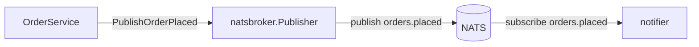

# 7. Messaging layer

So far, every layer has only ever talked to the layer directly below it. This chapter is different:
we're building two independent components — a publisher and a subscriber — that never call each
other directly, and only agree on a contract. That's what makes it a good place to introduce
messaging as a concept, not just as a library.

## Write the contract first

Before either side exists, decide what they'll agree on: a subject name, and the shape of the
event. Create `broker/broker.go`:

```go
package broker

import (
	"context"

	"example.com/servoorders/internal/domain"
)

const OrderPlacedSubject = "orders.placed"

type OrderPlacedEvent struct {
	OrderID string `json:"order_id"`
	UserID  string `json:"user_id"`
	Item    string `json:"item"`
}

type EventPublisher interface {
	PublishOrderPlaced(ctx context.Context, o *domain.Order) error
}
```

This is a slightly different situation than `repository` or `cache` from the last two chapters.
There, one interface has exactly one real implementation. Here, two components that will never
import each other — a publisher and a subscriber — both need this exact subject string and this
exact JSON shape, so the contract has to live somewhere neither of them owns exclusively:



## Build the publisher

Create a directory called `broker/natsbroker/`, not `broker/nats/`. Worth pausing on why: the client library
you're about to import, `github.com/nats-io/nats.go`, declares its own package as `nats`. Name your
own package `nats` too, and every file that needs both it and the client library ends up needing an
import alias on one of them — a small, permanent tax for no benefit. This is a real category of
naming collision, not specific to NATS; watch for it whenever a wrapper's natural name matches the
library it wraps.

`broker/natsbroker/natsbroker.go`:

```go
package natsbroker

import (
	"context"
	"encoding/json"
	"fmt"

	"example.com/servoorders/internal/broker"
	"example.com/servoorders/internal/observability"
	"example.com/servoorders/internal/domain"
	"github.com/nats-io/nats.go"
)

type Publisher struct {
	url  string
	conn *nats.Conn
}

var _ broker.EventPublisher = (*Publisher)(nil)

// Config owns NATS_URL for the whole messaging layer — the consuming end
// takes this struct rather than declaring its own; see the notifier below.
//
//servo:config prefix=NATS
type Config struct {
	URL string `config:"url,required"`
}

func New(cfg Config) *Publisher {
	return &Publisher{url: cfg.URL}
}
```

The capability methods follow the pattern from the last two chapters, with NATS's own vocabulary
for each: `Drain` is NATS's graceful "finish in-flight work, then disconnect," and `IsConnected`
gives `Health` something real to check:

```go
func (p *Publisher) Init(context.Context) error {
	conn, err := nats.Connect(p.url)
	if err != nil {
		return fmt.Errorf("natsbroker: connect: %w", err)
	}
	p.conn = conn
	return nil
}

func (p *Publisher) Stop(context.Context) error {
	p.conn.Drain()
	return nil
}

func (p *Publisher) Health(context.Context) error {
	if !p.conn.IsConnected() {
		return fmt.Errorf("natsbroker: not connected (status: %s)", p.conn.Status())
	}
	return nil
}
```

And the one method the interface actually asked for:

```go
func (p *Publisher) PublishOrderPlaced(ctx context.Context, o *domain.Order) error {
	raw, err := json.Marshal(broker.OrderPlacedEvent{
		OrderID: o.ID.String(),
		UserID:  o.UserID.String(),
		Item:    o.Item,
	})
	if err != nil {
		return fmt.Errorf("natsbroker: marshal: %w", err)
	}
	if err := p.conn.Publish(broker.OrderPlacedSubject, raw); err != nil {
		return fmt.Errorf("natsbroker: publish: %w", err)
	}
	return nil
}
```

## Build the consuming side

A real second service would subscribe to `orders.placed` independently, in its own process. We're
building `notifier` in this same binary instead, purely so the event-driven half of this
architecture is visible and testable without standing up an actual second service. Create
`broker/notifier/notifier.go`:

```go
package notifier

import (
	"context"
	"encoding/json"
	"fmt"

	"example.com/servoorders/internal/broker"
	"example.com/servoorders/internal/broker/natsbroker"
	"example.com/servoorders/internal/observability"
	"github.com/nats-io/nats.go"
)

type Notifier struct {
	url string
	log *observability.Logger
}

// New takes natsbroker.Config rather than declaring a config of its own.
// Both ends of the messaging layer connect to the same server, and under
// //servo:config a setting has exactly one owner — a second struct tagged
// to read NATS_URL would be a collision `servo generate` refuses, with
// both declaration sites named. The publisher's package owns the setting;
// this package borrows the value, and the import says so.
func New(cfg natsbroker.Config, log *observability.Logger) *Notifier {
	return &Notifier{url: cfg.URL, log: log}
}
```

Now `Run` — and this is the first component in the tutorial with no `Init` at all, which is worth
noticing as a deliberate choice, not a gap. There's nothing useful to do with a subscription except
hold it open until shutdown, so connecting happens inside `Run` itself:

```go
func (n *Notifier) Run(ctx context.Context) error {
	conn, err := nats.Connect(n.url)
	if err != nil {
		return fmt.Errorf("notifier: connect: %w", err)
	}
	sub, err := conn.Subscribe(broker.OrderPlacedSubject, func(msg *nats.Msg) {
		n.inFlight.Add(1)
		defer n.inFlight.Done()
		n.handle(ctx, msg)
	})
	if err != nil {
		conn.Close()
		return fmt.Errorf("notifier: subscribe: %w", err)
	}

	n.mu.Lock()
	n.conn, n.sub = conn, sub
	n.mu.Unlock()

	<-ctx.Done()
	return nil
}
```

`Run` blocking on `<-ctx.Done()` is the standard shape for anything servo will detect as a
`Runner` — it returns when, and only when, the context it was given is cancelled, which is exactly
what lets servo's generated shutdown code wait for it to actually stop.

Notice what `Run` does **not** do: it tears nothing down. No `defer sub.Unsubscribe()`, no
`defer conn.Close()`. That is deliberate, and it is the setup for the next two methods.

## Stopping a consumer without losing messages

This is the one component in the tutorial that shows the difference between `Drain` and `Stop`, so
it is worth doing properly.

servo runs every `Runner` to completion *before* it calls `Shutdown`. If `Run` closed its own
subscription on the way out, there would be nothing left for the shutdown phases to do and the
distinction below would be decoration. Leaving the subscription open is what makes it real:

```go
// Drain stops consuming and waits for what is already being consumed.
func (n *Notifier) Drain(ctx context.Context) error {
	n.mu.Lock()
	sub := n.sub
	n.mu.Unlock()
	if sub == nil {
		return nil // Run never got as far as subscribing
	}

	if err := sub.Unsubscribe(); err != nil && !errors.Is(err, nats.ErrConnectionClosed) {
		return fmt.Errorf("notifier: unsubscribe: %w", err)
	}

	done := make(chan struct{})
	go func() {
		n.inFlight.Wait()
		close(done)
	}()

	select {
	case <-done:
		return nil
	case <-ctx.Done():
		return fmt.Errorf("notifier: handlers still running at drain deadline: %w", ctx.Err())
	}
}

// Stop releases the connection, after Drain has finished with it.
func (n *Notifier) Stop(context.Context) error {
	n.mu.Lock()
	conn := n.conn
	n.mu.Unlock()
	if conn == nil {
		return nil
	}
	conn.Close()
	return nil
}
```

Two halves, and the second is the one people leave out. `Unsubscribe` removes interest, so the
server sends nothing further — but at the moment shutdown begins there may be handlers midway
through, and returning right there abandons their work with no error anywhere. `inFlight` is a
`sync.WaitGroup` the subscription callback increments; waiting on it is what "drained" actually
means. The wait is bounded by the context servo passes, which carries the
[stop budget](../reference/lifecycle.md#the-stop-budget), so a handler that never returns is
reported rather than waited on forever.

`Stop` then closes the connection. Splitting them is not ceremony: they answer different questions —
`Drain` asks "is the work finished", `Stop` asks "is the socket closed" — and servo runs them in
that order, each under its own budget.

### About acks

Core NATS, which is what we are using, is **at-most-once and has no acknowledgement**. A message is
delivered once; whether the handler succeeds, fails, or panics, the server will not send it again.
That is precisely why `Drain` matters here — the only chance to finish that work is before the
process exits.

If you need redelivery, that is JetStream, and the handler would end in `msg.Ack()` on success and
`msg.Nak()` on a failure worth retrying. **The shape above does not change.** You still want
in-flight handlers to finish before shutdown, `Drain` is still what waits for them, and an
unacknowledged message at that point is one the broker will redeliver — which is the same
correctness argument arriving from the other direction.

The one case with no good answer either way is a message that will never parse. `handle` logs it
and moves on rather than retrying, because a payload that is malformed now will be malformed on
every redelivery, and a consumer that keeps retrying it stops consuming anything else.

## The trade-off we're accepting here

Before moving on, it's worth being honest about a gap in what we just built. The service layer
(next chapter) will write an order to Postgres, then call `PublishOrderPlaced`, and won't fail the
whole request if that publish fails — it'll only log. That's a real, known limitation: if the
process crashes between the database commit and the publish, or NATS is briefly unreachable, that
event is simply lost, even though the order itself was correctly saved. This is the classic
**dual-write problem** — two systems can't be updated atomically without a distributed transaction,
and Postgres and NATS don't share one.

The real fix is the **transactional outbox pattern**: write the event to an `outbox` table inside
the *same* Postgres transaction as the order, then have a separate process read unpublished rows
and publish them, marking each sent only after a confirmed publish. That gets you at-least-once
delivery — at the cost of a background poller, and the possibility that a consumer sees the same
event twice, which any real at-least-once consumer has to be built to tolerate (idempotent
processing, keyed by `OrderID`). We're not building an outbox in this tutorial — see
[chapter 21](21-alternatives-and-further-reading.md#the-outbox-pattern) for what it would take —
because the failure mode being visible and understood is more valuable here than the machinery to
eliminate it.

## Try it against real NATS

```
$ make up
$ TEST_NATS_URL=nats://localhost:4222 go test ./natsbroker/... ./notifier/... -v
=== RUN   TestPublishOrderPlacedIsReceivedBySubscribers
--- PASS: TestPublishOrderPlacedIsReceivedBySubscribers (0.01s)
=== RUN   TestHealthReflectsConnectionState
--- PASS: TestHealthReflectsConnectionState (0.00s)
PASS
ok  	example.com/servoorders/internal/broker/natsbroker	0.160s
=== RUN   TestRunLogsReceivedEvents
--- PASS: TestRunLogsReceivedEvents (0.05s)
PASS
ok  	example.com/servoorders/internal/broker/notifier	0.201s
```

The notifier test is worth a look before you write it, because it has to solve a real timing
problem: `Run`'s subscription registers asynchronously, after it connects, so publishing
immediately after starting `Run` in a goroutine can race ahead of the subscription actually being
ready. Rather than guess at a fixed delay (flaky if too short, slow if too long), it swaps `slog`'s
default handler for one writing into a buffer, then retries the publish in a short loop until the
buffer shows the event arrived.

## Diagnostics

- **`nats: no responders`** — NATS core telling you nothing is subscribed to the subject at all
  (not a delivery failure to an existing subscriber). Check that `notifier` — or your test's own
  subscription — actually started before the publish happened; the retry loop above exists
  specifically because this is a real race, not a hypothetical one.
- **`notifier` never logs anything even though publishing succeeds** — check the subject strings
  match *exactly*. Using `broker.OrderPlacedSubject` on both sides, instead of a hardcoded string on
  one, is what turns a typo here into a single-source-of-truth problem the compiler helps with,
  rather than a silent runtime mismatch.
- **An event arrives twice for one order** — shouldn't happen under what we built here (one
  `Publish` call per `CreateOrder`), but it's the first thing to check if an outbox poller is ever
  added: at-least-once delivery means *some* duplication is expected.

## Do's and don'ts

- **Do** keep the event payload minimal — an ID and just enough to route or filter on — rather than
  the full `domain.Order`. A consumer that needs the full order can fetch it; a wide payload becomes
  a compatibility burden the moment a second consumer depends on fields the first one didn't need.
- **Do** version your subjects or event schemas once more than one consumer exists in production.
  You can't coordinate a breaking payload change across every consumer's deploy the way you can
  within one service's own release.
- **Don't** assume a publish inside a database transaction is covered by that transaction's
  rollback — a message broker doesn't participate in a SQL transaction. If the publish genuinely
  needs to be transactionally consistent with the write, the outbox pattern above is the real
  answer, not call ordering.
- **Don't** let a subscriber's handler block indefinitely or panic — `notifier`'s handler
  deliberately does neither. A slow or panicking handler stalls or crashes the whole subscription,
  not just the one message.

## Next

[Chapter 8: Service layer](08-service-layer.md) — where the repository, the cache, and the broker
all come together into one place that has to reason about all three at once.
