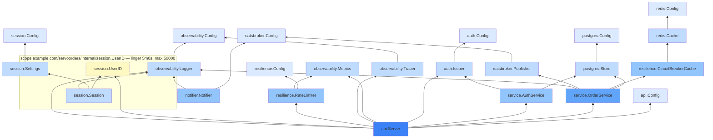

# 13. Wiring with servo

Nine packages exist now, each with its own constructor, and nothing connecting them yet — no
`main.go` that constructs a logger-shaped thing then a database then a cache then a service then a
server, checking errors and unwinding partial construction at every step. That's the file this
chapter doesn't write by hand.

## Declare the graph

Create `cmd/orders/spec.go`, gated by the `servoinject` build tag so it never compiles into the
real binary:

```go
//go:build servoinject

package main

import (
	"example.com/servoorders/internal/transport/api"
	"example.com/servoorders/internal/broker"
	"example.com/servoorders/internal/cache"
	"example.com/servoorders/internal/broker/natsbroker"
	"example.com/servoorders/internal/broker/notifier"
	"example.com/servoorders/internal/repository/postgres"
	"example.com/servoorders/internal/cache/redis"
	"example.com/servoorders/internal/repository"
	"github.com/okian/servo/v3/servo"
)

func wire() {
	servo.Build(
		servo.Root[*api.Server](),
		servo.Root[*notifier.Notifier](),

		servo.Bind[repository.OrderRepository, *postgres.Store](),
		servo.Bind[repository.UserRepository, *postgres.Store](),
		servo.Bind[cache.OrderCache, *redis.Cache](),
		servo.Bind[broker.EventPublisher, *natsbroker.Publisher](),
	)
}
```

Two roots: `api.Server` (everything the HTTP layer needs, transitively) and `notifier.Notifier`
(which nothing else depends on, so without declaring it a root, `servo` would never know to build
it at all — an unreferenced constructor is just dead code as far as the graph is concerned).

## A diagnostic worth triggering on purpose

Before adding the four `servo.Bind` lines above, try generating without them — just the two roots.
(This section also uses `mocks/servo_adapters.go`, written later in this same chapter — if you're
following in order and haven't created it yet, you'll see two implementers instead of three below,
which makes exactly the same point.)

```
$ go run github.com/okian/servo/v3/cmd/servo generate --dir .
example.com/servoorders/cmd/orders: servo: 4 diagnostic(s):

.../service/service.go:28:6: servo: no provider for example.com/servoorders/internal/repository.OrderRepository
  needed by *example.com/servoorders/internal/service.OrderService  .../service/service.go:28:6
  needed by *example.com/servoorders/internal/transport/api.Server            .../transport/api/server.go:49:6
  root                                                      .../cmd/orders/spec.go:23:3

  3 types implement example.com/servoorders/internal/repository.OrderRepository — add one of:
      servo.Bind[example.com/servoorders/internal/repository.OrderRepository, *example.com/servoorders/internal/mocks.MockOrderRepository]()      .../mocks/repository_mock.go:34:6
      servo.Bind[example.com/servoorders/internal/repository.OrderRepository, *example.com/servoorders/internal/mocks.OrderRepositoryForServo]()      .../mocks/servo_adapters.go:24:6
      servo.Bind[example.com/servoorders/internal/repository.OrderRepository, *example.com/servoorders/internal/repository/postgres.Store]()      .../repository/postgres/postgres.go:41:6
```

(Three more diagnostics follow, identical in shape, for `UserRepository`, `OrderCache`, and
`EventPublisher`.) This is worth actually seeing rather than taking on faith, and it's worth
noticing there are *three* candidates, not two: `mocks.MockOrderRepository` (gomock's own
generated mock, from [chapter 8](08-service-layer.md)) and `mocks.OrderRepositoryForServo` (the
wrapper this chapter adds further down, for `servo.Override`) both structurally satisfy
`repository.OrderRepository` exactly as well as `postgres.Store` does. `servo` has no way to know
which one you meant "for real," and it's right not to guess. The four `Bind` lines above aren't
optional the way they might look in a module with only one implementation of each interface —
once even one mock exists anywhere in the module, an explicit `Bind` is what makes generation
succeed at all.

## Generate, and read what came back

With the binds in place:

```
$ go run github.com/okian/servo/v3/cmd/servo generate --dir .
```

No output — success is silent, matching every other servo command. `cmd/orders/servo_gen.go` now
exists, starting with a resolved-graph comment that's worth reading end to end before the code
below it.

This is the committed file from `examples/tutorial`, which is the *finished* service, so a few
entries come from chapters you haven't reached yet — `observability` (chapter 15), `resilience`
(chapter 16), and the `session` scope at the bottom (chapter 14). Generate it yourself at this
point and you'll get the same shape with those omitted:

```
//	[L0] example.com/servoorders/internal/auth.Config
//	      servo:config (prefix JWT)  internal/auth/auth.go:34:6
//	[L0] example.com/servoorders/internal/broker/natsbroker.Config
//	      servo:config (prefix NATS)  internal/broker/natsbroker/natsbroker.go:29:6
//	[L0] example.com/servoorders/internal/cache/redis.Config
//	      servo:config (prefix REDIS)  internal/cache/redis/redis.go:34:6
//	[L0] example.com/servoorders/internal/observability.Config
//	      servo:config (prefix OBS)  internal/observability/logging.go:19:6
//	[L0] example.com/servoorders/internal/repository/postgres.Config
//	      servo:config (prefix POSTGRES)  internal/repository/postgres/postgres.go:38:6
//	[L0] example.com/servoorders/internal/resilience.Config
//	      servo:config (prefix RATE_LIMIT)  internal/resilience/ratelimit.go:26:6
//	[L0] example.com/servoorders/internal/session.Config
//	      servo:config (prefix SESSION)  internal/session/session.go:58:6
//	[L0] example.com/servoorders/internal/transport/api.Config
//	      servo:config (prefix HTTP)  internal/transport/api/server.go:52:6
//	[L1] *example.com/servoorders/internal/session.Settings
//	      deps: example.com/servoorders/internal/session.Config
//	      capabilities: none | binding: sole candidate | internal/session/session.go:73:6
//	[L1] *example.com/servoorders/internal/observability.Logger
//	      deps: example.com/servoorders/internal/observability.Config
//	      capabilities: none | binding: sole candidate | internal/observability/logging.go:34:6
//	[L2] *example.com/servoorders/internal/broker/notifier.Notifier
//	      deps: example.com/servoorders/internal/broker/natsbroker.Config, *example.com/servoorders/internal/observability.Logger
//	      capabilities: Runner, Drainer, Finalizer | binding: sole candidate | internal/broker/notifier/notifier.go:42:6
//	[L1] *example.com/servoorders/internal/repository/postgres.Store
//	      deps: example.com/servoorders/internal/repository/postgres.Config
//	      capabilities: Initializer, Finalizer, Healther | binding: explicit bind | internal/repository/postgres/postgres.go:42:6
//	[L1] *example.com/servoorders/internal/cache/redis.Cache
//	      deps: example.com/servoorders/internal/cache/redis.Config
//	      capabilities: Initializer, Finalizer, Healther | binding: sole candidate | internal/cache/redis/redis.go:38:6
//	[L2] *example.com/servoorders/internal/resilience.CircuitBreakerCache
//	      deps: *example.com/servoorders/internal/cache/redis.Cache
//	      capabilities: none | binding: explicit bind | internal/resilience/breaker.go:38:6
//	[L1] *example.com/servoorders/internal/broker/natsbroker.Publisher
//	      deps: example.com/servoorders/internal/broker/natsbroker.Config
//	      capabilities: Initializer, Finalizer, Healther | binding: explicit bind | internal/broker/natsbroker/natsbroker.go:40:6
//	[L3] *example.com/servoorders/internal/service.OrderService
//	      deps: *example.com/servoorders/internal/repository/postgres.Store, *example.com/servoorders/internal/resilience.CircuitBreakerCache, *example.com/servoorders/internal/broker/natsbroker.Publisher, *example.com/servoorders/internal/observability.Logger
//	      capabilities: none | binding: sole candidate | internal/service/service.go:28:6
//	[L1] *example.com/servoorders/internal/auth.Issuer
//	      deps: example.com/servoorders/internal/auth.Config
//	      capabilities: none | binding: sole candidate | internal/auth/auth.go:39:6
//	[L2] *example.com/servoorders/internal/service.AuthService
//	      deps: *example.com/servoorders/internal/repository/postgres.Store, *example.com/servoorders/internal/auth.Issuer
//	      capabilities: none | binding: sole candidate | internal/service/auth_service.go:18:6
//	[L1] *example.com/servoorders/internal/observability.Metrics
//	      deps: none
//	      capabilities: none | binding: sole candidate | internal/observability/metrics.go:18:6
//	[L1] *example.com/servoorders/internal/observability.Tracer
//	      deps: example.com/servoorders/internal/observability.Config
//	      capabilities: Finalizer | binding: sole candidate | internal/observability/tracing.go:29:6
//	[L2] *example.com/servoorders/internal/resilience.RateLimiter
//	      deps: example.com/servoorders/internal/resilience.Config, *example.com/servoorders/internal/observability.Metrics
//	      capabilities: none | binding: sole candidate | internal/resilience/ratelimit.go:30:6
//	[L4] *example.com/servoorders/internal/transport/api.Server
//	      deps: example.com/servoorders/internal/transport/api.Config, *example.com/servoorders/internal/service.OrderService, *example.com/servoorders/internal/service.AuthService, *example.com/servoorders/internal/auth.Issuer, *example.com/servoorders/internal/observability.Metrics, *example.com/servoorders/internal/observability.Tracer, *example.com/servoorders/internal/resilience.RateLimiter, example.com/servoorders/internal/session.Sessions, *example.com/servoorders/internal/observability.Logger
//	      capabilities: Runner, Finalizer, Readier | binding: sole candidate | internal/transport/api/server.go:57:6
//
// scope example.com/servoorders/internal/session.UserID
//
//	linger: 5m0s | max: 50000
//	accessor: example.com/servoorders/internal/session.Sessions -> *example.com/servoorders/internal/session.Session
//	[S1] *example.com/servoorders/internal/session.Session
//	      capabilities: Initializer, Flusher, Finalizer
//	borrows: *example.com/servoorders/internal/session.Settings, *example.com/servoorders/internal/observability.Logger
```

## Capabilities, side by side

Nine chapters built these components one at a time; here's every capability every one of them
ended up with, in one place, and *why* each is what it is:

| Type | Capabilities | Why |
|---|---|---|
| each package's `Config` | none | Pure data, filled by its generated `ServoConfig` loader before anything is constructed |
| `session.Settings` | none | The singleton carrier between `session.Config` and the scope — [chapter 14](14-scoped-instances.md) |
| `observability.Logger` | none | Built from its own config; everything that logs depends on it |
| `postgres.Store` | Initializer, Finalizer, Healther | Connects, disconnects, and can report a real health check |
| `redis.Cache` | Initializer, Finalizer, Healther | Same shape as Store — connect/disconnect/health |
| `natsbroker.Publisher` | Initializer, Finalizer, Healther | Same shape again |
| `service.OrderService` | none | Pure orchestration logic, nothing to start or stop |
| `auth.Issuer` | none | Pure JWT/hashing logic |
| `service.AuthService` | none | Pure orchestration logic |
| `api.Server` | Runner, Finalizer | Serves until told to stop ([chapter 10](10-api-layer.md)'s `Run` bug lives here); `Stop` closes the listener |
| `notifier.Notifier` | Runner (no Finalizer) | Its own cleanup (`conn.Drain()`) happens via `defer` inside `Run` itself when `ctx` cancels, not a separate `Stop` |

Every one of these is detected structurally — `types.Implements`, checked at generation time.
Nothing in any of these nine packages imports `servo` except the spec file itself. `notifier`
having *no* `Stop` isn't a gap: it genuinely doesn't need one, and servo doesn't require every
component to implement every capability, or even any of them.

## New, Run, and Shutdown

```go
func New(ctx context.Context) (*App, error) {
	a := &App{}

	authConfig, err := auth.ServoConfig()
	if err != nil {
		return nil, err
	}
	// ... one generated ServoConfig call per //servo:config type the graph
	// uses — natsbroker, redis, observability, postgres, resilience,
	// session, api — each loaded before anything is constructed, each held
	// as a local rather than an App field ...

	store, err := postgres.New(postgresConfig)
	if err != nil {
		return nil, err
	}
	a.store = store
	// ... then cache, publisher, logger, orderService, issuer,
	// authService, server, notifier ...

	{
		var timingMu sync.Mutex
		g, gctx := errgroup.WithContext(ctx)
		g.Go(func() error {
			start := time.Now()
			err := a.store.Init(gctx)
			timingMu.Lock()
			a.startupReport.Nodes = append(a.startupReport.Nodes, servo.StartupNode{Type: "*example.com/servoorders/internal/repository/postgres.Store", Duration: time.Since(start)})
			timingMu.Unlock()
			return err
		})
		// ... cache.Init, publisher.Init, run concurrently in the same errgroup ...
		if err := g.Wait(); err != nil {
			report := a.Shutdown(ctx)
			return nil, errors.Join(err, report)
		}
	}
	return a, nil
}
```

Construction happens in dependency order — `config` before anything that needs it, `store` before
`orderService`. `Init` calls for the three Initializers run *concurrently*, in one `errgroup`,
since none of them depend on each other (all three only depend on `config`, which is already
built) — servo doesn't serialize work that has no reason to be serial. If any `Init` fails, `New`
calls `Shutdown` itself before returning, so a failed startup never leaves the components that
*did* succeed connected with nothing tracking them.

`Run` launches every `Runner` and waits for all of them — this is exactly the errgroup shown in
[chapter 10](10-api-layer.md#run-and-stop--and-a-bug-worth-hitting-on-purpose)'s postmortem, so
its behavior should already feel familiar rather than new. `Shutdown` runs in *reverse* order —
`api.Server` first (stop accepting new work before tearing down what it depends on), then the
three infrastructure Finalizers — each one exactly once, via `sync.Once`, so a second `Shutdown`
call (or two concurrent ones) is safe.

## Check it, graph it, ask it questions

```
$ go run github.com/okian/servo/v3/cmd/servo check --dir .
```

Silent, same as generate — `check` re-resolves and re-emits in memory, diffs against what's
committed, and only prints something if they disagree.

```
$ go run github.com/okian/servo/v3/cmd/servo graph --dir ./cmd/orders --format=mermaid
graph BT
  n0["example.com/servoorders/internal/auth.Config"]:::level0
  n1["example.com/servoorders/internal/broker/natsbroker.Config"]:::level0
  n2["example.com/servoorders/internal/cache/redis.Config"]:::level0
  n3["example.com/servoorders/internal/observability.Config"]:::level0
  n4["example.com/servoorders/internal/repository/postgres.Config"]:::level0
  n5["example.com/servoorders/internal/resilience.Config"]:::level0
  n6["example.com/servoorders/internal/session.Config"]:::level0
  n7["example.com/servoorders/internal/transport/api.Config"]:::level0
  n8["*example.com/servoorders/internal/session.Settings"]:::level1
  n9["*example.com/servoorders/internal/observability.Logger"]:::level1
  n10["*example.com/servoorders/internal/broker/notifier.Notifier"]:::level2
  n11["*example.com/servoorders/internal/repository/postgres.Store"]:::level1
  n12["*example.com/servoorders/internal/cache/redis.Cache"]:::level1
  n13["*example.com/servoorders/internal/resilience.CircuitBreakerCache"]:::level2
  n14["*example.com/servoorders/internal/broker/natsbroker.Publisher"]:::level1
  n15["*example.com/servoorders/internal/service.OrderService"]:::level3
  n16["*example.com/servoorders/internal/auth.Issuer"]:::level1
  n17["*example.com/servoorders/internal/service.AuthService"]:::level2
  n18["*example.com/servoorders/internal/observability.Metrics"]:::level1
  n19["*example.com/servoorders/internal/observability.Tracer"]:::level1
  n20["*example.com/servoorders/internal/resilience.RateLimiter"]:::level2
  n21["*example.com/servoorders/internal/transport/api.Server"]:::level4
  subgraph scope0["scope example.com/servoorders/internal/session.UserID — linger 5m0s, max 50000"]
    k0["example.com/servoorders/internal/session.UserID"]:::scopekey
    n22["*example.com/servoorders/internal/session.Session"]:::level1
  end
  n8 --> n6
  n9 --> n3
  n10 --> n1
  n10 --> n9
  n11 --> n4
  n12 --> n2
  n13 --> n12
  n14 --> n1
  n15 --> n11
  n15 --> n13
  n15 --> n14
  n15 --> n9
  n16 --> n0
  n17 --> n11
  n17 --> n16
  n19 --> n3
  n20 --> n5
  n20 --> n18
  n21 --> n7
  n21 --> n15
  n21 --> n17
  n21 --> n16
  n21 --> n18
  n21 --> n19
  n21 --> n20
  n21 --> k0
  n21 --> n9
  n22 --> k0
  n22 --> n8
  n22 --> n9
  classDef level0 fill:#dbeafe;
  classDef level1 fill:#bfdbfe;
  classDef level2 fill:#93c5fd;
  classDef level3 fill:#60a5fa;
  classDef level4 fill:#3b82f6;
  classDef scopekey fill:#fef9c3,stroke-dasharray: 4 2;
```

That's the complete, unedited output — the `classDef` lines are what give each level its own
shade when rendered. Here it is rendered, with the full import paths shortened to just the type
name so it's actually readable at a glance:



And a targeted question — why does `postgres.Store` exist at all, from the graph's perspective:

```
$ go run github.com/okian/servo/v3/cmd/servo why --dir ./cmd/orders postgres.Store
root  *example.com/servoorders/internal/transport/api.Server
  -> *example.com/servoorders/internal/service.OrderService
  -> *example.com/servoorders/internal/repository/postgres.Store
```

## Testing the whole thing without any of it running

Everything up to this point still needs real Postgres, Redis, and NATS to actually construct.
`servo.Override` changes that, for tests specifically — add it to `spec.go`, alongside the binds:

```go
servo.Override[repository.OrderRepository, *mocks.OrderRepositoryForServo](),
servo.Override[repository.UserRepository, *mocks.UserRepositoryForServo](),
servo.Override[cache.OrderCache, *mocks.OrderCacheForServo](),
servo.Override[broker.EventPublisher, *mocks.EventPublisherForServo](),
```

The gomock mocks from chapter 8 can't be used directly here: `NewMockOrderRepository(ctrl
*gomock.Controller)` needs a `*gomock.Controller`, which itself needs something implementing
`gomock.TestReporter` — and there's no `*testing.T` reachable from inside a generated graph.
`servotest.PanicReporter` (from servo's own `servotest` package) supplies one without pulling
gomock into servo's own `servotest` at all — the same pattern servo's `examples/mocking/gomock`
already establishes. Create `mocks/servo_adapters.go`:

```go
package mocks

import (
	"go.uber.org/mock/gomock"

	"github.com/okian/servo/v3/servotest"
)

type OrderRepositoryForServo struct {
	*MockOrderRepository
	Finish func()
}

func NewOrderRepositoryForServo() *OrderRepositoryForServo {
	ctrl := gomock.NewController(servotest.PanicReporter{})
	return &OrderRepositoryForServo{MockOrderRepository: NewMockOrderRepository(ctrl), Finish: ctrl.Finish}
}

// UserRepositoryForServo, OrderCacheForServo, and EventPublisherForServo
// follow the exact same three-line shape, one per remaining interface.
```

Regenerating now also produces `cmd/orders/servo_gen_test.go` — a `NewTestApp` with the same
shape as `New`, except the four overridden dependencies are the zero-arg `*ForServo` wrappers
instead of `postgres.New`/`redis.New`/`natsbroker.New`.

Two things about `NewTestApp` are easy to assume and both wrong — worth stating plainly rather
than letting you find out by confusion:

- **`notifier.Notifier` still needs a real NATS connection**, even here. It was built in
  [chapter 7](07-messaging-layer.md) to open its own connection directly rather than going through
  `broker.EventPublisher` — a deliberate choice at the time, to demonstrate the consuming side of
  messaging independently — but it means `notifier` isn't one of the four interfaces `Override`
  touches. Calling `TestApp.Run(ctx)` would still try to reach real NATS. The test below never
  calls `Run` for exactly this reason.
- **A config is required exactly as long as something in the graph consumes it.** The overrides
  replaced the postgres and redis consumers with mocks, so their configs drop out of the test
  graph entirely — `NewTestApp` never loads them, and `POSTGRES_DSN` and `REDIS_ADDR` don't need
  to be set at all. `NATS_URL` still does: the notifier takes `natsbroker.Config` and isn't one of
  the overridden interfaces. `JWT_SECRET` is the one value that actually matters here, since
  `auth.Issuer` is real and unmocked.

With both of those understood, the test itself is straightforward — construct, expect, hit the
HTTP handler directly:

```go
func TestFullAPIFlowWithMockedInfrastructure(t *testing.T) {
	t.Setenv("NATS_URL", "unused-in-this-test")
	t.Setenv("JWT_SECRET", "test-secret")

	app, err := NewTestApp(context.Background())
	if err != nil {
		t.Fatalf("NewTestApp: %v", err)
	}
	t.Cleanup(func() {
		app.userRepositoryForServo.Finish()
		app.orderRepositoryForServo.Finish()
		app.orderCacheForServo.Finish()
		app.eventPublisherForServo.Finish()
	})

	hash, _ := auth.HashPassword("password123")
	testUser := &domain.User{ID: uuid.MustParse("11111111-1111-1111-1111-111111111111"), Username: "alice", PasswordHash: hash}
	app.userRepositoryForServo.EXPECT().GetByUsername(gomock.Any(), "alice").Return(testUser, nil)
	app.orderCacheForServo.EXPECT().Set(gomock.Any(), gomock.Any()).Return(nil)
	app.orderRepositoryForServo.EXPECT().Create(gomock.Any(), gomock.Any()).Return(nil)
	app.eventPublisherForServo.EXPECT().PublishOrderPlaced(gomock.Any(), gomock.Any()).Return(nil)

	ts := httptest.NewServer(app.server.Handler())
	defer ts.Close()

	// ... POST /auth/login, then POST /orders with the returned token ...

	if r := app.Shutdown(context.Background()); !r.Clean() {
		t.Errorf("Shutdown not clean: %v", r)
	}
}
```

`app.server`, `app.userRepositoryForServo`, and friends are all unexported fields — reachable here
only because this test file lives in `package main`, the same package `servo_gen_test.go` does,
exactly like servo's own `examples/basic/cmd/basic/app_test.go` reaches into its generated `App`
the same way.

```
$ go test ./cmd/orders/... -v
=== RUN   TestFullAPIFlowWithMockedInfrastructure
--- PASS: TestFullAPIFlowWithMockedInfrastructure (0.12s)
PASS
ok  	example.com/servoorders/cmd/orders	0.521s
```

Every layer from [chapter 5](05-repository-layer.md) through [chapter 10](10-api-layer.md), wired
exactly the way `main.go` wires it for real, running in well under a second, with zero containers.

## Diagnostics

- **`servo: N diagnostic(s)` listing two implementers of the same interface** — as demonstrated
  above, this is what happens the moment a mock and a real implementation coexist in one module
  with no explicit `Bind`. The fix is always the same: add the `servo.Bind[...]()` the error
  message already suggests.
- **`NewTestApp` fails with a "required environment variable" error** — see the config nuance
  above; every required field still needs a value in a test, even an unused placeholder string for
  the three that won't actually be dialed.
- **A test calling `TestApp.Run` hangs or fails to connect** — `notifier` isn't behind an
  overridden interface; don't call `Run` in a test that has no real NATS available. Test the HTTP
  surface directly through `app.server.Handler()` instead, as shown above.
- **A `NewTestApp`-based HTTP test gets back an unexpected `500` instead of an obvious crash** —
  check the test's logged output for a line like `"msg":"api: panic recovered","panic":"Unexpected
  call to *mocks.MockOrderRepository.Create(...) because: there are no expected calls..."`. A
  `PanicReporter` panic raised from *inside* a request handler (a missing or wrong `.EXPECT()` on
  the mock that handler calls) still happens inside `recoverMiddleware`'s reach ([chapter
  10](10-api-layer.md)) — so it gets caught, logged, and turned into an ordinary `500` response,
  exactly the way a real, unrelated panic would. The test doesn't crash; it just fails with a
  confusing status code. The fix is almost always a missing or misconfigured `.EXPECT()`, not a bug
  in the handler.
- **A `NewTestApp`-based test crashes the whole process with a full Go stack trace mentioning
  `servotest.PanicReporter`** — unlike the case above, this is a `PanicReporter` panic firing
  *outside* any request (most often from `ctrl.Finish()` inside a `t.Cleanup`, verifying every
  `.EXPECT()` was actually called) — nothing wraps it in a `recover`, so it takes the test binary
  down with it. The panic message itself names the problem directly — `missing call(s) to
  *mocks.MockOrderCache.Set(...)` or `Unexpected call to ... because: there are no expected
  calls...` — and the receiver type in that message (`*mocks.MockOrderCache`, `*mocks.
  MockOrderRepository`, etc.) is exactly which mock to go fix the expectations on.
- **`servo check` reports drift right after a manual edit to `servo_gen.go`** — expected; the file
  is marked `DO NOT EDIT` for exactly this reason. Change the source, not the generated output, and
  regenerate.

## Do's and don'ts

- **Do** add `servo.Bind` for an interface as soon as a second structural implementer appears
  anywhere in the module — including a mock. Waiting for the diagnostic to tell you is fine;
  treating it as a bug in `servo` instead of a real ambiguity is not.
- **Do** keep `spec.go` as the *only* file that imports `servo` (besides generated output). If a
  second file starts importing it, that's usually a sign some wiring logic escaped the spec file.
- **Don't** hand-edit `servo_gen.go` or `servo_gen_test.go`, ever, even for a "quick" fix — the
  next `servo generate` silently overwrites it, and `servo check` in CI exists specifically to
  catch a hand-edited file that's drifted from what the real source would produce.
- **Don't** add a root for something nothing else needs unless you actually want it constructed
  and run — an orphaned root is a real, if harmless, way to accidentally start something (a
  listener, a connection) that was only meant to exist as a library.

## Next

[Chapter 14: Scoped instances](14-scoped-instances.md) — the one thing in this graph that shouldn't
be built once and held forever.
