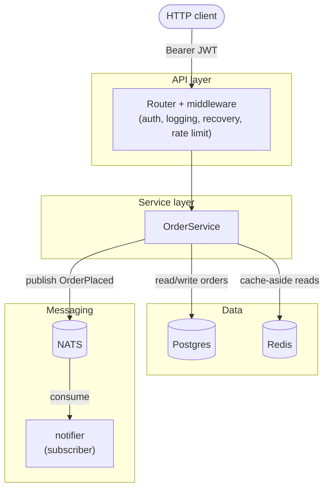

# Building a microservice with servo

A step-by-step, from-scratch build of a real order-management service — HTTP API, JWT auth,
Postgres, Redis, NATS, Prometheus metrics, OpenTelemetry tracing, a circuit breaker, a full test
suite, CI/CD, and a Docker deployment — using [servo](../../README.md) to wire and run all of it.

Every chapter's code lives in [`examples/tutorial`](../../examples/tutorial), a real, separate Go
module you can `cd` into and run at every step. Nothing in these pages is invented: every code
block is copied from that module, and every command's output shown here was actually run.

## Who this is for

You should be comfortable writing Go and using `go test`, but this tutorial assumes nothing about
prior exposure to dependency injection, microservice architecture, or any of the specific
libraries used (Postgres, Redis, NATS, JWT, Prometheus, OpenTelemetry). Each is introduced when
it's first needed, with a short "what and why" before the code.

## Prerequisites

- Go 1.25 or newer (`go version`)
- [Docker](https://docs.docker.com/get-docker/) with the `docker compose` plugin, for running
  Postgres, Redis, and NATS locally
- `curl` (or any HTTP client) for the "try it yourself" sections
- No cloud account of any kind is required — everything runs on your machine

## What you'll build

A user logs in, gets a JWT, and can place and view orders. Placing an order writes to Postgres,
invalidates the cache, and publishes an `OrderPlaced` event; a separate `notifier` component
consumes that event to show the "other side" of an event-driven system without needing an actual
second service. Every arrow in that diagram is a real dependency `servo` resolves and wires for
you — nothing here is assembled by hand.

## Chapters

| # | Chapter | What it covers |
|---|---------|-----------------|
| 1 | [Architecture overview](01-architecture-overview.md) | Layers, why layered, where servo fits |
| 2 | [Project setup](02-project-setup.md) | Module layout, tools, the Makefile |
| 3 | [Configuration](03-configuration.md) | Typed env config, validation, secrets |
| 4 | [Domain layer](04-domain-layer.md) | Core types, framework-free |
| 5 | [Repository layer](05-repository-layer.md) | Postgres, migrations, connection pooling |
| 6 | [Caching layer](06-caching-layer.md) | Redis, cache-aside, invalidation |
| 7 | [Messaging layer](07-messaging-layer.md) | NATS, publish/subscribe, delivery guarantees |
| 8 | [Service layer](08-service-layer.md) | Business logic, orchestration, domain errors |
| 9 | [Authentication](09-authentication.md) | JWT issue/verify, password hashing, middleware |
| 10 | [API layer](10-api-layer.md) | Routing, DTOs, validation, error mapping |
| 11 | [Wiring with servo](11-wiring-with-servo.md) | The spec file, capabilities, `servo generate` |
| 12 | [Observability](12-observability.md) | Structured logs, metrics, tracing, health checks |
| 13 | [Resilience](13-resilience.md) | Circuit breaker, rate limiting, graceful shutdown |
| 14 | [Testing strategy](14-testing-strategy.md) | Unit, integration, and API-level tests |
| 15 | [CI/CD](15-cicd.md) | GitHub Actions: lint, test, build, `servo check` |
| 16 | [Running and deployment](16-running-and-deployment.md) | Docker Compose, Dockerfile, env reference |
| 17 | [Troubleshooting](17-troubleshooting.md) | Common errors per layer and how to fix them |
| 18 | [Alternatives and further reading](18-alternatives-and-further-reading.md) | Other valid choices at every layer |

Read them in order the first time through — each one assumes the code from the previous chapters
already exists. After that, they stand alone well enough to use as reference.
